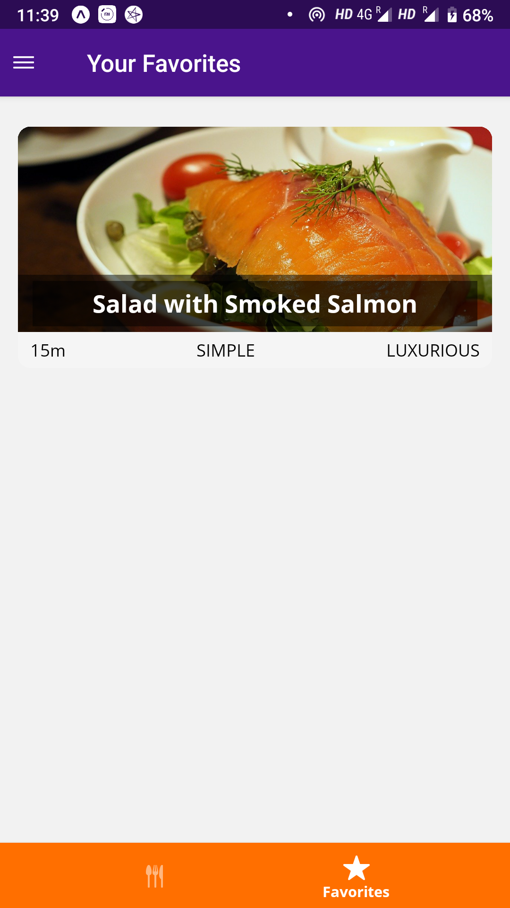

# MealsApp
React Native App using Redux Store, Routes and React Navigation API.


# React Native & Expo Starter

Awesome starter template to help you build mobile app with React native and Expo.

### Table of contents

* [Install](#install)
* [Usage](#usage)
* [Screens](#screens)

### Install

#### Clone this repository

```
git clone https://github.com/alexdevero/react-native-expo-starter.git
```
#### Install Expo CLI

```
npm install -g expo-cli
```
#### Install Expo CLI for iOS and Android

[Download Expo client for Android from the Play Store](https://play.google.com/store/apps/details?id=host.exp.exponent)

[Download Expo client for iOS from the App Store](https://itunes.com/apps/exponent)

⚠️ Required operating system versions: The minimum Android version is Lollipop (5)  and the minimum iOS version is iOS 10.0.

#### run Expo client on your pc

[iOS instructions](https://docs.expo.io/versions/latest/workflow/ios-simulator/)

[Android instructions](https://docs.expo.io/versions/latest/workflow/android-studio-emulator/)

#### Install dependencies


```
npm install
```
or
```
yarn
```

### Usage

#### Run the app

```
npm start
```
or
```
yarn start
```

After running expo server on your local machine open expo app that you have installed on your smartphone.

Scan QR code which is generated by expo server from expo Android/iOS App.

Congrats now you can get the recipe of your favorite meal.

### Screens
 
&nbsp;&nbsp;&nbsp;&nbsp;&nbsp;&nbsp;&nbsp;&nbsp;&nbsp;&nbsp;&nbsp;&nbsp;&nbsp;&nbsp;&nbsp;&nbsp;&nbsp;&nbsp;

&nbsp;&nbsp;&nbsp;&nbsp;&nbsp;&nbsp;&nbsp;&nbsp;&nbsp;&nbsp;&nbsp;&nbsp;&nbsp;&nbsp;&nbsp;&nbsp;&nbsp;&nbsp;

&nbsp;&nbsp;&nbsp;&nbsp;&nbsp;&nbsp;&nbsp;&nbsp;&nbsp;&nbsp;&nbsp;&nbsp;&nbsp;&nbsp;&nbsp;&nbsp;&nbsp;&nbsp;
